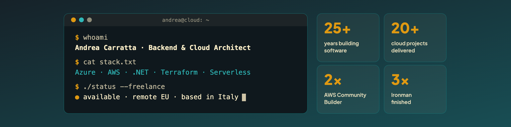

# Andrea Carratta

**Backend Developer & Cloud Architect · Freelance · AWS Community Builder (Serverless)**

> The system creaks. The cloud costs too much. I fix it.

I work with founders, CTOs and engineering teams of startups and scale-ups.
Usually I get called when the software that worked fine yesterday starts struggling with growth: slower responses, rising cloud bills, every release a risk.

25+ years building software. The last years focused on cloud-native backends on Azure and AWS.

## What I do

- **Architecture review** - find the real bottleneck before adding more infrastructure
- **Cloud cost reduction** - remove waste, right-size, match pricing models to actual workloads
- **Event-driven & serverless backends** - queues, retries, idempotency, dead-letter handling: systems that degrade instead of falling over
- **Safer releases** - architectures that let you deploy without taking the whole platform down
- **Data storage design** - SQL vs NoSQL, partitioning, access patterns
- **Infrastructure as Code** - reproducible environments with Terraform
- **Hands-on delivery** - I write the code, not just the diagrams, and leave the team something easy to maintain

## Track record

- 25+ years building software
- 20+ cloud projects delivered
- AWS Community Builder - Serverless (2025, 2026)
- 20+ talks on software and cloud

## How I work

- Problem first, technology second
- Fewer moving parts beats more services
- More technology does not always mean a better product
- If I can help, I'll tell you. If I can't, I'll tell you that too.

## Stack

- **Azure:** Functions · Service Bus · Data Factory · Cosmos DB · Storage · Key Vault · Application Insights
- **AWS:** Lambda · EC2 · SQS · SES · S3 · DynamoDB · CloudWatch
- **Backend & data:** C# / .NET · SQL Server
- **Infrastructure:** Terraform · Docker

## Latest writing

<table>
<tr><th>Date</th><th>Post</th><th>Source</th></tr>
<!-- POSTS-EN:START -->
<tr><td>2026-10-02</td><td><a href="https://devandreacarratta.it/en/technical-stories/aws-lambda-to-ec2-nightly-import/">From AWS Lambda to EC2: The Choice That Was Right Until It Wasn&#39;t</a></td><td>Website</td></tr>
<tr><td>2026-09-21</td><td><a href="https://devandreacarratta.it/en/technical-stories/how-i-built-my-first-ruby-gem-with-kiro/">How I built my first Ruby Gem with Kiro</a></td><td>Website</td></tr>
<tr><td>2026-09-14</td><td><a href="https://devandreacarratta.it/en/coding-zone/using-password-forge/">Using PasswordForge: a Practical Guide</a></td><td>Website</td></tr>
<tr><td>2026-09-09</td><td><a href="https://devandreacarratta.it/en/technical-stories/how-i-almost-destroyed-a-production-ec2-with-terraform/">How I almost destroyed a production EC2 with Terraform</a></td><td>Website</td></tr>
<tr><td>2026-08-17</td><td><a href="https://blog.devandreacarratta.it/en/aws-route53-domain-registration/">AWS Route 53: How to Register a Domain</a></td><td>Blog</td></tr>
<tr><td>2026-06-13</td><td><a href="https://devandreacarratta.it/en/projects/aws-amplify-staging-branch-preview-terraform/">AWS Amplify: Automatic Branch Previews and Staging with Terraform</a></td><td>Website</td></tr><!-- POSTS-EN:END -->
</table>

🇮🇹 Latest in Italian

<table>
<tr><th>Date</th><th>Post</th><th>Source</th></tr>
<!-- POSTS-IT:START -->
<tr><td>2026-10-05</td><td><a href="https://devandreacarratta.it/technical-stories/serverless-o-ec2-perche-ho-scelto-ec2/">Serverless non è sempre la risposta: perché questa volta ho scelto EC2</a></td><td>Website</td></tr>
<tr><td>2026-09-25</td><td><a href="https://devandreacarratta.it/behind-the-code/git-branch-feature-qualita-software/">Git branch: perché creare un branch per ogni feature migliora la qualità del software</a></td><td>Website</td></tr>
<tr><td>2026-09-17</td><td><a href="https://devandreacarratta.it/prodotto-software-pronto-a-crescere/">Creare un prodotto è diventato più facile. Farlo crescere, è un altro paio di maniche</a></td><td>Website</td></tr>
<tr><td>2026-09-01</td><td><a href="https://devandreacarratta.it/comportamenti-emergenti-sistemi-distribuiti/">Comportamenti emergenti nei sistemi distribuiti: la lezione di una playlist Spotify</a></td><td>Website</td></tr>
<tr><td>2026-08-24</td><td><a href="https://devandreacarratta.it/burnout-sviluppo-software/">Burnout nello sviluppo software: il problema inizia molto prima di quanto immagini</a></td><td>Website</td></tr><!-- POSTS-IT:END -->
</table>

## Off the clock

- 🏃 **Runner** - 3 Ironman finished back in my triathlon days, still running in the Bergamo Alps. Lesson: shortcuts feel great. Until you reach the climb.
- 🐈 🐈 **Two cats** - TV companions and senior rubber-duck debuggers for critical incidents
- 🧩 **Rubik's Cube mindset** - break the problem down, find the right sequence, don't scramble what already works
- 🎤 **Sharing what I learn** - blog posts, 20+ talks, AWS Community Builder
- 🍕 **5,000+ pizzas eaten** - research is ongoing

## Work with me

Available for new freelance projects. Based in Italy (CET), working remotely across the EU.

Languages: Italian (native) · English (conversational, B1)

- 📅 [Book a free 15-min call](https://tidycal.com/devandreacarratta/) - booking page in Italian, calls in English welcome
- 💼 [LinkedIn](https://www.linkedin.com/in/acarratta/)
- 🌐 [Website](https://devandreacarratta.it/en/)
- ✍️ [Blog](https://blog.devandreacarratta.it/)
